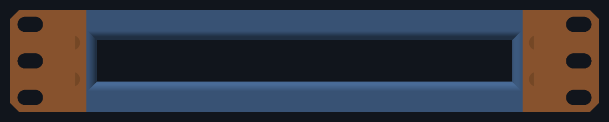

# Lab Rax 1U device brackets

*someone might find it useful :-)*

**1U brackets for a [Lab Rax 10" rack](https://makerworld.com/en/models/1464819-lab-rax-10-server-rack-bolted-version-5u),
bolted to the front *and* rear posts.**

Lab Rax itself — the racks, panels and the rest of the system these brackets
fit into — is the [Lab Rax collection on MakerWorld](https://makerworld.com/en/collections/5813742-lab-rax).

**Everything prints on a Bambu Lab A1 mini.** Its 180 × 180 × 180 mm bed is
the design limit for every part, and each device's 3MF comes already plated
for it.

## Quick start

You do not need FreeCAD, Python or anything else in this repository to print
a bracket. The 3MF files are complete.

1. **Print.** Open the 3MF in your device's folder in Bambu Studio and print
   all six plates, in PETG. See [Printing](#printing).
2. **Buy.** 16 × M6 × 12 button-head screws, 4 × M6 nuts, 12 × M6 washers.
   See [Fasteners](#fasteners).
3. **Assemble.** Legs onto the rear posts; sides, tray, device and faceplate
   built on the bench and slid in from the front. See [Assembly](#assembly).

Before committing to the long prints, read [Before you print](#before-you-print):
two small test pieces tell you whether the sliding joint fits on your printer.

## What you can mount

| device | model code | size (mm) | faces the front | print |
|---|---|---|---|---|
| **UniFi Cloud Gateway Fiber** | `UCG-Fiber` | 212.8 × 127.6 × 30, 734 g | its 0.96" display, through an oval window | `ucg-fiber/UCG_Fiber_LabRax-A1mini.3mf` |
| **UniFi Flex Mini 2.5G** | `USW-Flex-2.5G-5` | 117.1 × 90 × 21.2, 206 g | its 5 × 2.5 GbE ports, through an open frame | `usw-flex-mini/USW_Flex_LabRax-A1mini.3mf` |
| **TP-Link Easy Smart switch** | `TL-SG108E` | 158 × 101 × 25 | its 8 × GbE ports, through an open frame | `tl-sg108e/TL_SG108E_LabRax-A1mini.3mf` |
| **Intel NUC, Skull Canyon** | `NUC6i7KYK` | 211 × 116 × 28, 45 W | its front USB and audio, through an open frame | `nuc6i7kyk/NUC6i7KYK_LabRax-A1mini.3mf` |




### Will mine fit?

Anything inside this envelope can be carried by the same chassis. It needs a
new device folder with a `device.py` profile in it, and three prints of its
own — see [Adding a device](#adding-a-device).

| | limit | set by |
|---|---|---|
| width | **up to 212.8 mm** | the bay between the rails, 214.0 less clearance |
| depth | **up to 127.6 mm** | the sides' rear stops, 129 mm behind the faceplate |
| height | **up to 33.65 mm** | 1U, less the tray and a flange to cap the device |
| weight | the gateway's 734 g is the heaviest modelled | a 214 × 132 × 6 tray deflects about 0.2 mm under it |
| cooling | passive, or drawing air from underneath | a tray can be slotted, but the front is closed apart from its opening |

A device that fills the bay is held straight by the sides' own rails. One
narrower than **210.8 mm** gets walls on its tray instead, and those walls
need the device to be **204 mm or less**, so widths between about 204 and
210.8 mm are the one gap in the range. A device shorter than the U gets a
plinth under it to centre it in the opening. The faceplate is either a
**window** onto a display or a **frame** onto ports.

What it cannot do: anything over 1U, anything deeper than the rear stops
allow, or anything needing full access to both long faces at once. The
faceplate closes the front apart from its opening, so the busier face has to
go to the back.

## Parts

Seven prints for one device, none over a 180 mm bed.

| part | size (mm) | qty | kit |
|---|---|---|---|
| `side_l` / `side_r` | 33 × 212.5 × 44.5 | 1 each | chassis |
| `leg_l` / `leg_r` | 33 × 91.5 × 44.5 | 1 each | chassis |
| `tray_ucg_l` / `tray_ucg_r` | 136.5 × 131.4 × 9 | 1 each | UCG-Fiber |
| `faceplate_ucg` | 213.6 × 20 × 44.5 | 1 | UCG-Fiber |
| `tray_usw_l` / `tray_usw_r` | 136.5 × 128.4 × 19.6 | 1 each | Flex Mini |
| `faceplate_usw` | 213.6 × 20 × 44.5 | 1 | Flex Mini |
| `tray_sg108e_l` / `tray_sg108e_r` | 136.5 × 128.4 × 17.7 | 1 each | TL-SG108E |
| `faceplate_sg108e` | 213.6 × 20 × 44.5 | 1 | TL-SG108E |
| `tray_nuc_l` / `tray_nuc_r` | 136.5 × 128.4 × 11.2 | 1 each | NUC6i7KYK |
| `faceplate_nuc` | 213.6 × 20 × 44.5 | 1 | NUC6i7KYK |

**Four of the seven are a chassis that takes no notice of what is in it.**
The sides and the rear legs are sized by the rack alone; only the tray pair
and the faceplate are drawn around a device. A second device therefore costs
three prints rather than seven.

A **side** carries the front ear, the side rail, the ledge the tray lands on,
a rear stop, and behind that a **dovetail tongue** along the inner face of the
rail. A **rear leg** carries the rear ear and a **groove** that tongue slides
into. There is no screw between them. At the foot of each leg is a sprung
**catch**, and along the bottom of each rail a notch it runs in: the end stop.

The **tray** comes in halves — at 214 mm it will not fit the bed in any
orientation — lapping 60 mm across the centreline, the left half passing
underneath. Four ⌀5 pegs key them, and they take no screw.

The **faceplate** is the front, in one piece. What is cut in it depends on the
device: a window to see a display through, or a frame opening onto ports. A
flange along its top reaches back over the device so it cannot lift. Its four
nuts slide into slots in its two **ends**, where they stay put.

It is not a front cantilever. The gateway is heavy enough that hanging it off
the front posts alone would work the plastic, so each side runs into a rear
leg that reaches the back posts — four mounting points, twelve screws.


## Printing

**There is one 3MF per device and each carries the chassis too**: six plates,
1–3 the shared chassis, 4–6 that device's own tray pair and faceplate. Open
one, print all six, done. Every plate is labelled in Bambu Studio with the kit
it belongs to. If you build more than one device, plates 1–3 are identical in
every file — print them once per bracket.

| plates | kit | filament | time |
|---|---|---|---|
| 1–3 | chassis (in every file) | 112.1 g | 5 h 46 |
| 4–6 | UCG-Fiber | 149.0 g | 5 h 37 |
| 4–6 | Flex Mini 2.5G | 136.7 g | 5 h 22 |
| 4–6 | TL-SG108E | 142.7 g | 5 h 35 |
| 4–6 | NUC6i7KYK | 133.7 g | 5 h 34 |

A chassis and one kit is about 261 g for the gateway and 249 g for the Flex
Mini. Print in **PETG**: a gateway running IDS/IPS gets warm enough that PLA
is a poor choice around it.

The parts are already turned the way they print: the sides at 45°, the
faceplate stood on edge and upside down so that its flange lies on the bed,
the trays flat. Supports and brims are set per part in the file. Per-plate
figures are in [docs/bom.md](docs/bom.md); settings, orientations and what to
adjust if something is tight are in
[docs/print-settings.md](docs/print-settings.md).

### Before you print

- **Print the two coupons first.** `common/stl/coupon_tongue.stl` and
  `common/stl/coupon_groove.stl` are 25 mm of the side-to-leg runner. Print
  them standing as they are, then slide one into the other. If they bind,
  raise `RUN_FIT` in `common/src/params.py` from 0.25 and rebuild; if they
  rattle, lower it. A dovetail's fit depends on the printer far more than on
  the number, and a side is a two-hour print.
- **Then print one side** and offer it up to the rack. The 0.925 mm per side
  between the rails and the posts is the tightest dimension in the design,
  and a printed rack's post spacing varies.
- **Check the catch moves.** Each leg has a sprung finger at its foot, printed
  flat on the bed with a 1.2 mm slit above it. If the slicer has filled that
  slit with support, clear it out, or the finger cannot move.
- **Measure your device.** Case dimensions are the manufacturers' published
  figures, not calliper measurements, and the weights of the TL-SG108E and
  the NUC are estimates. Before printing a frame faceplate, measure the port
  strip on your unit against the opening given under
  [How each device is held](#how-each-device-is-held).

## Fasteners

**One screw for the whole bracket: M6 × 12.**

| qty | item |
|---|---|
| 16 | M6 × 12 button head |
| 4 | M6 nut — DIN 934, 10 mm across the flats, 5 mm thick |
| 12 | M6 washer — DIN 125 form A, ⌀12.5 |

| qty | where | nut | washer |
|---|---|---|---|
| 12 | bracket to rack: 3 per ear, 4 ears | none — in the post | yes |
| 4 | faceplate, through the front ears | 4 × M6 | no |

The side and the rear leg take none: one slides into the other. The tray
takes none either.

**The rack posts already hold the nuts** for the twelve rack screws, so those
are driven from outside the rack inwards and need no nut of their own.

**The length is not a free choice.** The post's hole is blind at 6 mm, so a
screw that goes more than 6 mm past the ear hits the end and never clamps, and
one that goes much less than 5 mm barely catches the nut. With the ear at
6.5 mm, a 12 mm screw enters 5.5 mm, with 3.5 mm of thread in the nut and half
a millimetre to spare.

**The twelve washers are not optional.** The rack screws go through slots, and
an M6 head is wider than a slot is: without a washer it lands on two crescents
of about 25 mm² and will bury itself in PETG. A washer takes that to
46–60 mm².

**The faceplate's nuts go in from its ends.** Each sits in a slot as tall as
the nut is across its flats, so it cannot turn, and closed in front and
behind, so it cannot fall out. Once the plate is between the sides, the rails
close the open ends too.

## Assembly

Everything with a screw in it is done either behind the rack or on the bench.
No screw has to be reached from inside the rack.

1. **Legs.** Bolt each rear leg to its rear post from behind — three M6 with
   washers — and leave them finger-tight. The grooves face forward.
2. **Nuts.** Slide an M6 nut into each of the four slots in the ends of the
   faceplate, flats top and bottom.
3. **Tray.** On the bench, stand the two sides facing each other and lay the
   tray across their ledges: the **left** half first, then the right half
   onto it, its pegs going down into the left half's sockets. The left half
   cannot be fitted under the right one. The tray spaces the sides.
4. **Device.** Set it straight down onto the tray, its back inside the tray's
   rear lip.
5. **Faceplate.** Lower it from above, behind the ears and in front of the
   device, until its flange sits over the device, and put four M6 through the
   ears into its nuts. It goes on **after** the device: the flange covers the
   device's front edge, and the device cannot be got in underneath it.
6. **Slide it in.** Offer the whole frame to the front of the rack and push:
   each side's tongue runs into its leg's groove, which opens out over its
   first 4 mm to catch it. About 35 mm from home the two catches click into
   their notches. Carry on until the front ears meet the posts.
7. **Bolt up.** Six M6 with washers through the front ears, then tighten the
   six at the back.

**The rack's depth sets itself.** The legs are fixed to the rear posts and the
sides to the front ones; the runner between them takes up whatever the
distance is, from 229 to 257 mm over the outside of the posts.

### The end stop

Undo the six front screws and the frame draws forward **35 mm and stops** —
40 on a 230 mm deep rack, 30 on a 240 — with 17 mm of each tongue still in its
groove.

**At the stop the faceplate can go on or come off in the rack.** It stands
wholly in front of the posts there, flange and all, clear of whatever is in
the U above. So the two sides can be slid in on their own until they click,
the faceplate lowered between them from above, behind the ears, and its four
screws put in from the front; or a faceplate changed without taking anything
else out. On a 240 mm rack the margin to a neighbouring bracket's screw heads
is about a millimetre.

That does not get the tray or the device in. They go in from above too, and
before the faceplate, and at 35 mm out most of the bay is still under
whatever is in the U above. With that U empty, everything can be done in the
rack. Otherwise the tray and the device go into the frame on the bench, as in
the steps above.

Seventeen millimetres of tongue locates the frame; it does not carry it.
**Hold the front up while it is at the stop**, or let it rest on what is
below.

**To take the frame right out**, reach in from the back of the rack and push
the two tabs at the foot of the legs towards the middle, then draw it
forward. Each tab is the tip of its catch; a screwdriver does as well as a
finger.

## How each device is held

| | UCG-Fiber | Flex Mini 2.5G | TL-SG108E | NUC6i7KYK |
|---|---|---|---|---|
| lifted by a plinth | no | 5.625 mm | 3.725 mm | 2.225 mm |
| sits at (z) | 6.0 – 36.0 | 11.625 – 32.825 | 9.725 – 34.725 | 8.225 – 36.225 |
| held sideways by | the rails, 0.6 mm a side | walls on its tray | walls on its tray | the rails, 1.5 mm a side |
| held down by | the faceplate's flange, 0.8 mm over the case | the same | the same | the same |
| held back by | its tray's rear lip | the same | the same | the same |
| opening (mm) | 22.5 × 11.0 window | 109.1 × 18.5 frame | 150 × 17 frame | 179 × 18 frame |
| round-over on the opening | 6 mm | 6 mm | 6 mm | 4 mm |
| tray | solid | solid | solid | slotted for air |

`z` is height above the bottom of the U, which is 44.45 mm tall.

**The gateway** fills the bay, so the rails hold it straight and the ears
overlap its ends by 12.4 mm. Its display faces front through a 22.5 × 11.0
window, slightly larger than the 21.0 × 10.0 display behind it. The window's
top edge sits 7.0 mm below the underside of the faceplate's flange.

**The Flex Mini** is 96.9 mm narrower than the bay and 8.8 mm shorter than the
gateway, and its ports are what you look at, so its tray carries a plinth
that lifts the case until it is centred in the U, and 4 mm walls that hold it
straight. Its frame leaves a 4 mm border each side, 1.85 mm below and 0.85
above. The opening is not centred on the case: centred, an RJ45 plug with its
latch would not go in, so the extra millimetre comes off the top border.

**The TL-SG108E** is held the same way, with a 4 mm border all round its
opening.

**The NUC** fills the bay like the gateway. Its border is 16 mm at each side
— a narrower one would run into the faceplate's nut slots — and 5 mm above and
below. It draws its cooling air through its underside, so its tray is slotted:
fore-and-aft slots open 27% of the width, floor to case. The centre lap stays
solid, because it is the joint holding the tray's halves together.

A frame's border is what keeps the case in, and it does so absolutely rather
than by friction: the case is wider and taller than the hole.


## Orientation and cooling

The gateway's ports and DC input are on one long face and its display on the
other, so its faceplate commits you to **display at the front, cables at the
back**. The two switches are the opposite: **ports at the front**, through the
frame, power at the back. The NUC shows its front USB and audio; everything
else is at the back.

Each side rail carries three windows, and the rear of the bracket is open.
Only the NUC's tray is slotted underneath; the others are solid.

One thing to know about the rear: on the two devices that fill the bay, the
outer 7 mm of each end of the back panel is behind the side's rear stop and
the leg. Keep plugs out of that last 7 mm.

## Compatibility with the rack

Interface numbers were measured off the Lab Rax models themselves rather than
taken from their description, because the published figures are rounded. How
each was obtained is in [docs/measurements.md](docs/measurements.md).

| | value | source |
|---|---|---|
| Faceplate | 254.0 × 44.45 mm (1U) | a Lab Rax 1U mount |
| Screw columns | 236.525 mm apart | rack posts |
| Hole heights in the U | 6.35 / 22.225 / 38.1 mm | EIA-310, confirmed on the posts |
| Screws | M6 | Lab Rax uses M6 throughout |
| Clear width between posts | 222.25 mm | derived from the post holes |
| Clear depth between posts | 170.0 mm | three frame members in the rack's 3MF |
| Front posts to rear posts | 230 or 240 mm outer | 170.0 plus two posts, 30 or 35 mm each |

**The bracket's width comes from the rack.** The posts leave 222.25 mm between
them; 0.925 mm of clearance a side and a 3.2 mm rail give a bay 214.0 mm wide.

**The ears carry clearance slots**, 11.0 × 6.6 mm, giving ±2.3 mm of sideways
adjustment.

**Depth is not a number to trust.** The post's section is 30 × 35 mm and the
mesh does not say which way it faces, so the outer depth is either 230 or
240 mm. The model takes 235 as nominal, and the runner covers 229 – 257 mm:
6 mm shallower than nominal before the leg meets the side's rear stop, 22 mm
deeper before less than 30 mm of tongue is left in the groove.

## Building from source

The parts are modelled in **FreeCAD**, generated by script rather than drawn.
`common/src/params.py` holds every dimension, each device's folder a
`device.py` profile, and `common/src/model.py` builds the bodies from them.
Each part is a PartDesign **Body** of **sketches** driving a **pad** or
**pocket**, so the documents open as something you can edit feature by
feature.

You need:

- **FreeCAD 1.x**, for `make`, `make verify` and `make assembly`. The
  Makefile runs it as a flatpak; set `FREECAD` to your own `freecadcmd` if
  yours is installed another way.
- **Python 3 with NumPy**, for the renders and the plated 3MFs.
- **Bambu Studio**, only for `make plates`. It is also run as a flatpak; set
  `BAMBU` to override.

```sh
make            # build, verify, check fasteners, render, plate
make verify     # re-check the solids against the rack, each device and the bed
make assembly   # put real M6 x 12 screws, nuts and washers in and check them
make plate      # one 3MF in each device's folder, for Bambu Studio
make plates     # slice every plate for real and measure the toolpaths
```

Every `.FCStd` and `.step` embeds a build timestamp, so `make` leaves them
looking modified even when nothing changed. The 3MFs and the STLs are
reproducible. Discard that churn with `git checkout -- '*.FCStd' '*.step'`.

### Adding a device

Add a folder with a `device.py` in it and name that folder in `DIRS` in
`common/src/devices.py`. Nothing else changes. The profile says:

- the case's width, depth and height, and its mass;
- `doc`, what its FreeCAD document and STEP are called;
- `plinth`, how far to lift it above the tray;
- `front`, a `Window` or a `Frame`, with an optional `fillet` to round over
  the opening's front edge;
- `vent=True` if it breathes through its underside and wants a slotted tray.

Then add its three plates to `KITS` in `common/tools/plate.py` and run `make`.

### What is checked

`make verify` measures the **built solids**, not the parameters, so a feature
that silently does nothing is caught rather than assumed away: 197 checks for
the NUC, 194 for the gateway, 193 each for the Flex Mini and the TL-SG108E.
Among them:

- each body is one valid solid, built from sketches, and fits the bed;
- no two parts overlap, and the faceplate and tray still clear what is beside
  them when they are *moved* a fraction of a millimetre, not just where they
  are drawn;
- an M6 passes all twelve rack slots and does not bottom out in the post;
- each leg is held on its tongue every way but along the rack's depth, and
  slides over the whole range claimed;
- the frame stops where it should when drawn out, on racks of either depth,
  and the faceplate can then be lowered into it clear of the U above;
- each faceplate nut slides the length of its slot and is trapped once there;
- the device drops in, is stopped on every face, and cannot be pushed out of
  the front.

`make assembly` places a real M6 × 12, nut and washer at each of the sixteen
positions and asks whether they fit what was actually built: 87 checks per
device.

`make plates` slices every plate and reads the toolpath extents back out of
the G-code, because a part that fits the bed and a print that fits the bed
are not the same claim.

All of this is geometry. None of it tests strength, or how a sliding fit
comes out on a particular printer — which is what the two coupons are for.

### Layout

```
common/
  src/
    params.py       every rack and design dimension, tagged [rack] / [design]
    devices.py      the Device / Window / Frame classes; loads each device's
                    profile, and says where each part's files go
    sk.py           sketch plumbing: planes, polygons, slots, pads, pockets,
                    fillets, and finding edges by where they are
    model.py        four chassis bodies plus three per device, and the coupons
  tools/
    verify.py       193 - 197 checks per device against the rack and the bed
    assembly.py     87 checks with real M6 solids at all sixteen positions
    measure_rack.py re-derives the [rack] numbers from the Lab Rax mesh files
    preview.py      renders each device's images/ from its STLs
    plate.py        arranges the STLs onto A1 mini plates as a Bambu 3MF
    checkplates.py  slices every plate for real and measures the toolpaths
  stl/              side_l, side_r, leg_l, leg_r, and the two test coupons
  cad/  step/       one FreeCAD document and STEP holding every part of every
                    device (it is called UCG_Fiber_LabRax)
ucg-fiber/          one folder per device:
  device.py           its profile: case, mass, plinth, front opening
  stl/                its tray pair and faceplate
  *.FCStd  *.step     the chassis and its three parts, as FreeCAD and STEP
  *.3mf               the chassis and its kit, plated for the A1 mini
  MAKERWORLD.md       the text posted with that 3MF on MakerWorld
  images/             renders of it assembled, and the pictures for MakerWorld
usw-flex-mini/  tl-sg108e/  nuc6i7kyk/
build.py            writes every FCStd, STEP and STL
docs/
  bom.md            what to print and what to buy, plate by plate
  measurements.md   where the rack's numbers came from
  print-settings.md settings, orientations and fit adjustment
```

## License

MIT; see [LICENSE](LICENSE). Lab Rax itself is not part of this repository
and is published under its own terms on MakerWorld.
