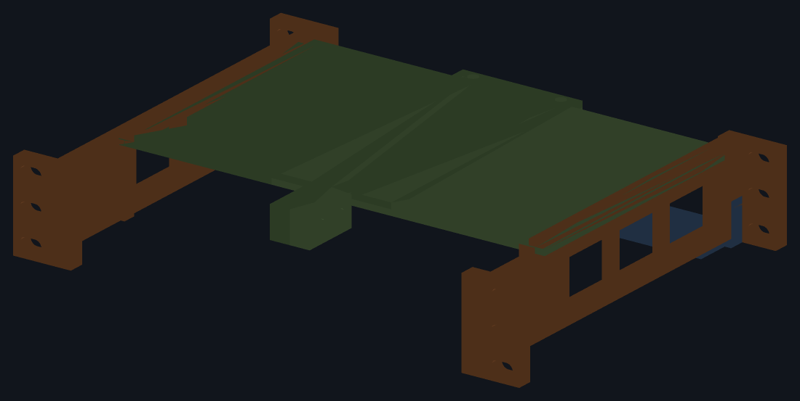

# UCG_Fiber

A 1U bracket that holds a **UniFi Cloud Gateway Fiber (UCG-Fiber)** in a
**Lab Rax 10" rack**, bolted to the front *and* rear rails.


The gateway is 212.8 mm wide and the rack's posts are 222.25 mm apart, so
there is 4.7 mm a side to work with. Most of the design follows from that.

Modelled in **FreeCAD**, but generated by a script rather than drawn:
`src/params.py` holds every dimension and `src/model.py` builds the parts from
it. Each part is a PartDesign **Body** made of **sketches** with a **pad** or
**pocket** on each, so the document opens as something you can edit feature by
feature.

```sh
make            # build the model and its exports, verify, render, plate
make verify     # re-check the solids against the rack, device and bed
make plate      # export/3mf/UCG_Fiber_LabRax-A1mini.3mf, for Bambu Studio
make plates     # slice every plate and check it prints inside the bed
```

## Layout

```
src/
  params.py       every dimension, tagged [rack] / [dev] / [design]
  sk.py           sketch plumbing: planes, polygons, slots, pads, pockets
  model.py        the six bodies
build.py          writes cad/, export/stl/, export/step/
tools/
  verify.py       100 checks against the rack, the device and the printer
  measure_rack.py re-derives the [rack] numbers from the Lab Rax mesh files
  preview.py      renders images/ (FreeCAD is headless here)
  plate.py        arranges the STLs onto A1 mini plates as a Bambu 3MF
  checkplates.py  slices all five for real and measures the toolpaths
  a1mini_project.json  the A1 mini preset the 3MF carries to be a project
docs/
  measurements.md where every number came from
  print-settings.md
```

## Compatibility

Interface numbers were measured off the Lab Rax models themselves rather than
taken from prose, because the published figures are rounded. The rack's own
3MFs sit one level up, in `../`. See
[docs/measurements.md](docs/measurements.md).

| | value | source |
|---|---|---|
| Faceplate | 254.0 × 44.45 mm (1U) | Lab Rax reference faceplate |
| Screw columns | 236.525 mm apart | rack posts |
| Hole heights in the U | 6.35 / 22.225 / 38.1 mm | EIA-310, confirmed on the posts |
| Screws | M6 | Lab Rax uses M6 throughout |
| Clear width between posts | 222.25 mm | derived from the post holes |
| Front posts to rear posts | 175.9 mm | side panel |
| Device | 212.8 × 127.6 × 30 mm | Ubiquiti UCG-Fiber spec |

**The rack posts already hold the nuts.** Measured from a post's outer face:
a ⌀7.60 clearance hole 2 mm deep, then a hexagon 10.09 mm across the flats and
5 mm deep — an M6 nut. So every rack screw is driven from **outside the rack
inwards**, and the bracket's ears carry nothing but clearance slots.

Those slots are **11.0 × 6.6 mm**, giving ±2.3 mm of horizontal adjustment. A
printed rack's posts do not land on the nominal 236.525 mm every time, and the
stock Lab Rax faceplates slot their holes for the same reason.

## Parts

Six prints, all distinct, none over a 180 mm bed.

| part | size (mm) | qty |
|---|---|---|
| `side_l` / `side_r` | 29 × 192 × 44.5 | 1 each |
| `tray_l` / `tray_r` | 137 × 167 × 16 | 1 each |
| `top_bar_l` / `top_bar_r` | 111 × 25 × 21 | 1 each |

A **side** is one piece: front ear, side rail, rear ear, the ledge the tray
lands on, and the rear stop. It reaches all the way from the front posts to
the rear ones, so the bracket is held at four points and is not a cantilever.

The **tray** is the floor the gateway stands on. At 214 mm it will not fit the
bed in any orientation, so it comes in halves that lap on the centreline. Each
half laps the other way onto its side's ledge. It is a light load over a wide
plate — 734 g over a 214 × 129 × 6 span works out around 0.2 mm of deflection
— so it does not need stiffening, only holding together and locating.

The **top bar** closes the front over the device, in halves for the same
reason. Each end nests into a notch in the side, so the ear and the rail still
meet underneath it.

The halves **lap across the middle** rather than meeting end to end: over the
centre 50 mm the left half is the front web and the right half is the flange
behind it, and two M3 pull them together. Butted, each half would hang off the
single M6 at its own end — a pivot — and the bar would sag with the seam
opening in the middle.



## Fasteners

| | |
|---|---|
| 12 × M6 × 12 button head | bracket to rack: 3 per ear, 4 ears |
| 2 × M6 × 20 + 2 × M6 nuts | top bar halves, through the front ears |
| 2 × M3 × 16 + 2 × M3 nuts | top bar halves to each other, across the lap |
| 2 × M6 × 20 + 2 × M6 nuts | tray halves to each other |

M6 everywhere it fits. The one exception is the pair across the top bar's own
lap: the bar is 7.65 mm tall between the device and the top of the U, and an
M6 nut is 11.55 mm across the corners. An M3 is 6.35 and goes in.

The rack screws need no nuts — the posts have them. The top-bar screw goes in
from the front, through the ear, and into a nut trapped in the bar with its
**pocket facing rear**; drop the nut in before offering the bar up.

The tray bolts run across the centre joint, both of them **behind the device**,
where a tab 30 mm deep and 16 mm tall has room for an M6 nut dropped in from
above.

**There is no bolt at the front of that joint, and there cannot be.** An M6
nut needs 15.5 mm of height once its corners and a wall are counted. The tray
is 6 mm thick, and anything standing above it there is standing in front of
the device's face — over the display, or over whichever ports sit low and
central. So the joint is made to carry the front instead: the lap is **60 mm
wide** and runs the full depth, the device's own weight closes it, the two M6
behind the device clamp it, and two ⌀5 pegs hold the halves square at the
front. Depth was never the problem — there are 16 mm there; height is.

## Assembly

1. Bolt the two sides to the rack — 3 × M6 into each of the four posts, driven
   from outside. Leave them finger-tight until step 4.
2. Drop two M6 nuts into the slots in the right tray half's rear tab. Lay both
   halves in — each lands on its side's ledge and laps the other on the
   centreline over 60 mm, and the two pegs at the front drop into their
   sockets. A nib in front and the rear stop behind hold them fore and aft, so
   they need no fixing to the sides. Run the two M6 in from the left.
3. **Lower the gateway in from above** onto the tray.
4. Fit the M6 nuts in the top bars and the two M3 nuts in the right half's
   lap slots, dropping them in from the top of the bar. Offer each half up
   into its notch, run an M6 in from the front through each ear, then the two
   M3 through the centre lap. Nip up the rack screws.

The gateway is held by the tray below, the side rails either side, the top bar
in front, the rear stops behind, and the top bar's flange above.

## Orientation

The gateway's ports and DC input are on one long face and its 0.96" display on
the other, so you choose one or the other at the rack front. The bracket takes
it either way round.

The ears reach in to x = ±98, so they cover about 8 mm of each end of the
device's face. That is what makes room for the top-bar screw inboard of the
rack slots. Check nothing you need sits in that last 8 mm.

## Cooling

The UCG-Fiber is fanless and vents through its underside and both sides. Each
side rail carries three windows and the rear is left open. Print it in
**PETG** — a gateway running IDS/IPS gets warm enough that PLA is a poor
choice around it.

## What is checked

`make verify` measures the built solids, not the parameters, so a feature that
silently does nothing is caught rather than assumed away. 100 checks: that each
body is one valid solid built from sketches driving pads and pockets; that it
fits the bed, turning a long part on the diagonal if it has to; that no two
parts foul each other; that an M6 passes all twelve rack slots; that the
top-bar screw runs through the ear and its nut both seats and can be fed in
from the rear; that the tray is solid under the device all the way across,
that both halves lap rather than butt, that each is carried by its side's
ledge, that a real M6 nut solid seats in each slot and can be dropped in from
above, and that nothing rises above the tray in front of the device's face;
that the top bar's halves lap and bear on each other rather than butting, and
are held at two widely spaced points so neither can pivot; and that the device
drops in and is stopped front, rear and above.

It has earned its keep. Building this version it caught the top bar
overrunning the 222.25 mm post opening, a notch cutting the wrong side of its
sketch plane, a nut slot cut on the wrong side of its bolt, and a malformed
slot wire whose mismatched endpoints made the sketch solver distort the two
sides differently.

It does not catch everything. That the tray joint was too small for the M6 it
was supposed to take was spotted by eye, in the FreeCAD window, not by the
checks — which is why they now seat a real nut solid rather than trusting a
dimension.

## Caveats

- **`RACK_D` (175.9 mm), front posts to rear posts, is inferred** from the
  side panel rather than measured on an assembled rack — the 3MF is a print
  plate, not an assembly. The rear ears land on it. If your rack differs, it
  is the one number to change.
- **0.925 mm per side between the rails and the posts is the tightest
  dimension**, and the top bar now takes the same. Print one side first and
  offer it up before committing to the rest.
- Device dimensions are Ubiquiti's published figures, not calliper
  measurements. `CLR_W` is 1.2 mm; widen it if yours is tight.
- No fillets. The geometry is kept to sketched prisms so the script stays
  robust; edges are square.
- `cad/*.FCStd` and `export/step/*` embed a build timestamp, so `make` leaves
  them looking modified even when nothing changed. The 3MF and the STLs are
  reproducible. Discard that churn with `git checkout -- cad export/step`.
