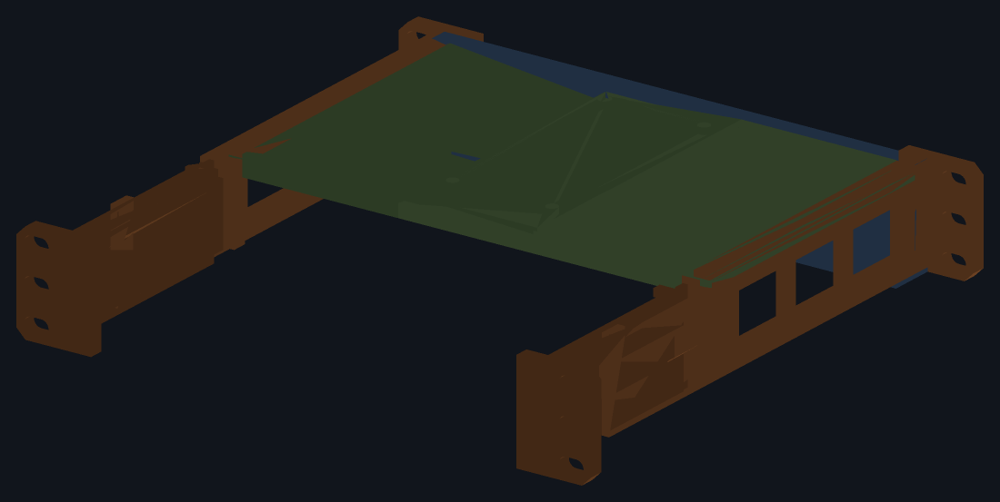

# Lab Rax 1U device brackets

*someone might find it useful :-)*

**1U brackets for a [Lab Rax 10" rack](https://makerworld.com/en/models/1464819-lab-rax-10-server-rack-bolted-version-5u),
bolted to the front *and* rear posts.**

Lab Rax itself — the racks, panels and the rest of the system these brackets
fit into — is the [Lab Rax collection on MakerWorld](https://makerworld.com/en/collections/5813742-lab-rax).

**Everything prints on a Bambu Lab A1 mini** — its 180 × 180 × 180 mm bed is
the design limit for every part. Anything wider than the bed is split (the
tray, in lapped halves) or turned to fit (the sides at 45°, the faceplate on
edge), and each device's 3MF comes already plated for the A1 mini. `make
verify` checks every part against the bed, and `make plates` slices every
plate to prove the toolpaths fit too.

## What you can mount

Four devices are modelled and checked today:

| device | model code | size (mm) | faces the front | print |
|---|---|---|---|---|
| **UniFi Cloud Gateway Fiber** | `UCG-Fiber` | 212.8 × 127.6 × 30, 734 g | its 0.96" display, through an oval window | `UCG_Fiber_LabRax-A1mini.3mf` |
| **UniFi Flex Mini 2.5G** | `USW-Flex-2.5G-5` | 117.1 × 90 × 21.2, 206 g | its 5 × 2.5 GbE ports, through an open frame | `USW_Flex_LabRax-A1mini.3mf` |
| **TP-Link Easy Smart switch** | `TL-SG108E` | 158 × 101 × 25 | its 8 × GbE ports, through an open frame | `TL_SG108E_LabRax-A1mini.3mf` |
| **Intel NUC, Skull Canyon** | `NUC6i7KYK` | 211 × 116 × 28, 45 W | its front USB and audio, through an open frame | `NUC6i7KYK_LabRax-A1mini.3mf` |

**There is one 3MF per device and each carries the chassis too**, six plates:
1–3 the shared chassis, 4–6 that device's own tray pair and faceplate. Open
one, print all six, done. Every plate is labelled in Bambu Studio with the kit
it belongs to. If you build both, the three chassis plates are identical in
the two files — print them once.


### Will mine fit?

Anything inside this envelope can be carried without touching the chassis —
only a new device folder with a `device.py` profile in it, and three prints:

| | limit | set by |
|---|---|---|
| width | **up to 212.8 mm** | the bay between the rails, 214.0 less clearance |
| depth | **up to 127.6 mm** | the ledge, which runs y 8 – 137 |
| height | **up to 33.65 mm** | 1U, less the tray and a flange to cap the device |
| weight | the gateway's 734 g is the tested case | a 214 × 132 × 6 tray deflects ~0.2 mm under it |
| cooling | passive, or drawing air from underneath | a tray can be slotted, but the front is closed apart from its opening |

A device narrower than **210.8 mm** gets walls on its tray to hold it straight,
since the sides' rails no longer touch it; those walls need the device to be
**204.8 mm or less**, so widths between 204.8 and 210.8 are the one gap in the
range. A device shorter than the U can have a plinth under it to centre it in
the opening, as the switch does. The faceplate is either a **window** onto a
display or a **frame** onto ports — say which in the profile and the rest
follows.

**A device that breathes through its underside gets a slotted tray.** Set
`vent=True` in its profile and fore-and-aft slots open the full-thickness part
of each half — 27% of the width, floor to case, measured rather than assumed.
The centre lap stays solid: a hole there would have to pass through both
halves where they overlap, and that lap is the joint holding the tray
together.

What it cannot do: anything over 1U, anything deeper than the ledge, or
anything needing full access to both long faces at once — the faceplate closes
the front apart from its opening, so the busier face has to go to the back.

**Four of the seven parts are a chassis that takes no notice of what is in
it.** The sides and the rear legs are sized by the rack alone; only the tray
pair and the faceplate are drawn around a device. A second device therefore
costs three prints rather than seven, and a chassis already printed carries
over untouched.

It is not a front cantilever. The gateway is heavy enough that hanging it off
the front posts alone would work the plastic, so each side runs into a rear
leg that reaches the back posts — four mounting points, twelve screws.

**It goes in like a drawer.** The legs are bolted to the rear posts first. The
sides, the faceplate, the tray and the device are put together on the bench
and slid in from the front as one piece, each side's tongue running into its
leg's groove. No screw has to be reached from inside the rack — see
[Assembly](#assembly).

Modelled in **FreeCAD** but generated by script rather than drawn.
`common/src/params.py` holds every dimension, each device's folder a
`device.py` profile, and `common/src/model.py` builds the bodies from them. Each part is a PartDesign
**Body** of **sketches** driving a **pad** or **pocket**, so the document opens
as something you can edit feature by feature.

```sh
make            # build, verify, render, plate
make verify     # re-check the solids against the rack, each device and the bed
make assembly   # put real M6 x 12 screws, nuts and washers in and check them
make plate      # one 3MF in each device's folder, for Bambu Studio
make plates     # slice every plate for real and measure the toolpaths
```

## Parts

Seven prints for one device, none over a 180 mm bed.

| part | size (mm) | qty | kit |
|---|---|---|---|
| `side_l` / `side_r` | 33 × 212.5 × 44.5 | 1 each | chassis |
| `leg_l` / `leg_r` | 33 × 91.5 × 44.5 | 1 each | chassis |
| `tray_ucg_l` / `tray_ucg_r` | 136.5 × 131.4 × 9 | 1 each | UCG-Fiber |
| `faceplate_ucg` | 213.6 × 20 × 44.5 | 1 | UCG-Fiber |
| `tray_usw_l` / `tray_usw_r` | 136.5 × 128.4 × 19.6 | 1 each | Flex Mini |
| `faceplate_usw` | 213.6 × 20 × 44.5 | 1 | Flex Mini |
| `tray_sg108e_l` / `tray_sg108e_r` | 136.5 × 128.4 × 17.7 | 1 each | TL-SG108E |
| `faceplate_sg108e` | 213.6 × 20 × 44.5 | 1 | TL-SG108E |
| `tray_nuc_l` / `tray_nuc_r` | 136.5 × 128.4 × 11.2 | 1 each | NUC6i7KYK |
| `faceplate_nuc` | 213.6 × 20 × 44.5 | 1 | NUC6i7KYK |

Two more, `coupon_tongue` and `coupon_groove` in `common/stl/`, are not part of
the bracket: they are 25 mm of the side-to-leg runner, to try its fit on your
printer before the sides and legs are printed.

A **side** carries the front ear, the side rail, the ledge the tray lands on,
a rear stop, and behind that a **dovetail tongue** along the inner face of the
rail. A **rear leg** carries the rear ear and a **groove** that tongue slides
into. There is no screw between them. At the foot of each leg is a sprung
**catch**, and along the bottom of each rail a notch it runs in: the end stop.

The **tray** comes in halves — at 214 mm it will not fit the bed in any
orientation — lapping 60 mm across the centreline, the left half passing
underneath. Four ⌀5 pegs key them. **They take no screw**: the one that used
to be there snapped off both halves the first time it was tightened.

The **faceplate** is the front, in one piece. What is cut in it depends on the
device: a window to see a display through, or a frame opening onto ports. Its
four nuts slide into slots in its two **ends**, where they stay put.

At 214 × 44.5 mm it will not lie flat on a 180 mm bed — 187 mm on the diagonal
— so it prints **stood on edge and upside down**, 165.5 mm cornerwise. Upside
down matters: the right way up, the flange that reaches over the device is a
12 mm shelf hanging over nothing. Inverted, that flange lies on the bed and
needs no support.



## Assembly

Everything with a screw in it is done either behind the rack or on the bench.

1. **Legs.** Bolt each rear leg to its rear post from behind — three M6 with
   washers — and leave them finger-tight. The grooves face forward.
2. **Nuts.** Slide an M6 nut into each of the four slots in the ends of the
   faceplate, flats top and bottom.
3. **Front frame.** On the bench, stand the faceplate between the two sides,
   behind the ears, and put four M6 through the ears into those nuts. The
   sides close the ends of the slots, so the nuts cannot come out again.
4. **Tray.** Drop the **left** half in first, then the right half onto it:
   its pegs go down into the left half's sockets. The left half cannot be
   fitted under the right one.
5. **Device.** It goes in from above and behind, nose first under the
   faceplate's flange, and drops behind the tray's rear lip.
6. **Slide it in.** Offer the whole frame to the front of the rack and push:
   each side's tongue runs into its leg's groove, which opens out over its
   first 4 mm to catch it. About 35 mm from home the two catches click into
   their notches. Carry on until the front ears meet the posts.
7. **Bolt up.** Six M6 with washers through the front ears, then tighten the
   six at the back.

### The end stop

Undo the six front screws and the frame draws forward **35 mm and stops** —
40 on a 230 mm rack, 30 on a 240 — with 17 mm of each tongue still in its
groove. It no longer runs off the end of its runners into your hands.

**At the stop the faceplate can go on or come off in the rack.** It stands
wholly in front of the posts there, flange and all, with 10 mm to spare on the
deepest rack — clear of a neighbour in the U above, whose own faceplate
screws stand 8.8 mm proud. So the two sides can be slid in on their own until
they click, the faceplate lowered between them from above, behind the ears,
and its four screws put in from the front; or a faceplate changed without
taking anything else out.

That does not get the tray or the device in. They go in from above too, and
at 35 mm out most of the bay is still under whatever is in the U above. With
that U empty, everything can be done in the rack. Otherwise the tray and the
device go into the frame on the bench, as above.

Seventeen millimetres of tongue locates the frame; it does not carry it.
**Hold the front up while it is at the stop**, or let it rest on what is
below.

**To take the frame right out**, reach in from the back of the rack and push
the two tabs at the foot of the legs towards the middle, then draw it
forward. Each tab is the tip of its catch; a screwdriver does as well as a
finger.

**Why it is this way round.** The side goes in from the front and the leg
from the rear — each is stopped by its own ear, which is wider than the gap
between the posts — so whatever joins them has to be made inside the rack.
That joint used to be two M6 a side through the rail, with their heads on the
rail's outer face, 0.9 mm from the post line and facing the rack's side wall.
There is no driving a screw there. A joint that only has to be pushed
together does not need reaching at all.

## Why the chassis is shared

Because its width comes from the **rack**, not from the gateway. The posts
leave 222.25 mm between them; 0.925 mm of clearance a side and a 3.2 mm rail
give a bay **214.0 mm** wide. The UCG-Fiber needing exactly that is a happy
accident of a well-chosen device — so a device half the width needs no change
to the sides or legs at all.

The sides' ledge and rear stop are likewise the chassis's own numbers now. A
device shorter than the stop simply leaves it unused behind it and is caught
by its own tray's lip instead.

Adding a device means adding a folder with a `device.py` in it — case size,
mass, how far to lift it, and what the faceplate does — and naming that folder
in `DIRS` in `common/src/devices.py`. Nothing else.

## Compatibility with the rack

Interface numbers were measured off the Lab Rax models themselves rather than
taken from prose, because the published figures are rounded. The rack's own
3MFs sit one level up, in `../`. See
[docs/measurements.md](docs/measurements.md).

| | value | source |
|---|---|---|
| Faceplate | 254.0 × 44.45 mm (1U) | Lab Rax reference faceplate |
| Screw columns | 236.525 mm apart | rack posts |
| Hole heights in the U | 6.35 / 22.225 / 38.1 mm | EIA-310, confirmed on the posts |
| Screws | M6 | Lab Rax uses M6 throughout |
| Clear width between posts | 222.25 mm | derived from the post holes |
| Clear depth between posts | 170.0 mm | three frame members in the rack's 3MF |
| Front posts to rear posts | 235.0 mm outer | 170.0 + two 32.5 mm posts |

**The rack posts already hold the nuts.** Measured from a post's outer face: a
⌀7.60 clearance hole 2 mm deep, then a hexagon 10.09 mm across the flats and
5 mm deep — an M6 nut. So every rack screw is driven from **outside the rack
inwards**, and the bracket's ears carry nothing but clearance slots, 11.0 ×
6.6 mm, giving ±2.3 mm of adjustment.

**Depth is set by fitting, not by the number.** The side panel's 175.9 mm is
not the gap between the posts: the panel is 3 mm thick and seats about 2.95 mm
into a groove at each end, and 170.0 + 2 × 2.95 is 175.9 exactly. Reading
175.9 as the gap once made this bracket 16 mm too long. The post's section is
30 × 35 and the mesh does not say which way it faces, so the outer depth is
either 230 or 240; the nominal sits between them at 235 and **the runner
takes up the difference by itself, covering 229 – 257 mm**: 6 mm shallower
than nominal before the leg meets the side's rear stop, 22 mm deeper before
less than 30 mm of tongue is left in the groove.

## Fasteners

**One screw for the whole bracket: M6 × 12.**

| qty | item |
|---|---|
| 16 | M6 × 12 button head |
| 4 | M6 nut — DIN 934, 10 mm across the flats, 5 mm thick |
| 12 | M6 washer — DIN 125 form A, ⌀12.5 |

| qty | where | nut | washer |
|---|---|---|---|
| 12 | bracket to rack: 3 per ear, 4 ears | none — in the post | yes |
| 4 | faceplate, through the front ears | 4 × M6 | no |

The side and the rear leg take none: one slides into the other.

**The length is not a free choice.** The post's hole is **blind at 6 mm**, so a
screw that goes more than 6 mm past the ear hits the end and never clamps, and
one that goes much less than 5 mm barely catches the nut. That fixes the ear at
**6.5 mm**: a 12 mm screw then enters 5.5 mm, with 3.5 mm of thread in the nut
and half a millimetre to spare.

**The twelve washers are not optional.** Those screws go through slots, and an
M6 head is wider than a slot is: without a washer it lands on two crescents of
about 25 mm² and will bury itself in PETG. A washer takes that to 46–60 mm².

The tray takes no fastener at all.

**The faceplate's nuts go in from its ends.** Each sits in a slot cut in from
the end of the plate, as tall as the nut is across its flats so it cannot
turn, and closed in front and behind so it cannot fall out. Once the plate is
between the sides, the rails close the open ends too. The nut sits 1.5 mm
behind the front face, and a 12 mm screw ends flush with its far side: 5 mm of
thread. They used to be fed in from behind, into pockets open to the rear,
with the upper pair worked 12 mm under the flange by fingertip. `verify`
sweeps each nut the length of its slot, and checks there is plate behind it
and rail across the mouth, because seating is not fitting.

## How each device is held

| | UCG-Fiber | Flex Mini 2.5G |
|---|---|---|
| sits at | z 6.0 – 36.0 | z 11.625 – 32.825 |
| sideways | the sides' own rails, 0.6 mm a side | walls on its tray at x ±59.15 |
| up | the faceplate's flange, 0.8 mm over the case | the same, at z 33.625 |
| back | its tray's rear lip at y 136.6 | its tray's rear lip at y 99.0 |
| forward | the faceplate across its whole face | the frame's border |

**The gateway** fills the bay, so the rails hold it straight and the ears
overlap its ends by 12.4 mm. Its display faces front through a **22.5 × 11.0
window** with a 6 mm round-over, placed by a rule about the printed part — the
oval's top edge sits exactly 7.0 mm below the underside of the top bar — which
`verify` measures on the built solid. Two calliper readings taken off the case
put that window wrong before the rule replaced them.

**The switch** is another matter. It is 96.9 mm narrower than the bay and
8.8 mm shorter, and its ports are what you look at, so its tray carries a
**5.625 mm plinth** that lifts the case until it is centred in the U — 22.225,
which is the U's centre to three decimals — and **4 mm walls at x ±59.15** that
hold it straight. Its faceplate is a **frame**: a 109.1 × 18.5 mm opening onto
the ports, leaving a 4 mm border each side, **1.85 mm below and 0.85 above**,
with a **6 mm round-over on its front edge** — the same bezel the gateway's
window has, leaving 2 mm of the 8 mm plate behind it.

**That opening is not centred on the case.** Centred, an RJ45 would not go in.
The bottom edge — the one a plug's body sits on — stays put, and the extra
millimetre comes off the top border. What is centred in the U is the **case**,
which is the plinth's job and what makes the front look right.

The border is what retains it, and retention is absolute rather than
frictional: a 117.1 × 21.2 case cannot pass a 109.1 × 18.5 hole. The **plug**
sets the height — an RJ45 with its latch needs about 16 mm on a case only
21.2 mm tall — so `verify` sweeps a 12 × 16 mm plug envelope through the
opening *and* the 8 mm of plate behind it to prove one fits.

**Every tray reaches the rear stops**, whatever its device's depth. What
locates a tray fore and aft is the strip riding the ledge — the faceplate in
front of it, the sides' rear stops behind — so that strip runs back to
y 136.6 on all of them. Without it the Flex Mini's tray slid **38 mm** inside
the bracket, the TL-SG108E's 27 and the NUC's 12.


## Orientation and cooling

The gateway's ports and DC input are on one long face and its 0.96" display on
the other. The faceplate's window commits you to **display at the front,
cables at the back**. The switch is the opposite: **ports at the front**,
through the frame.

Both devices are fanless. Each side rail carries three windows, the rear is
left open, and the tray is clear underneath. Print in **PETG** — a gateway
running IDS/IPS gets warm enough that PLA is a poor choice around it.

One thing to know about the rear: the outer 7.4 mm of each end of the
gateway's back panel is covered full height by the side's rear stop and the
leg behind it. Keep plugs out of that last 7.4 mm.

## What is checked

Two tools, each run once per device, and they check different things.

`make verify` measures the **built solids**, not the parameters, so a feature
that silently does nothing is caught rather than assumed away. **197 checks for
the NUC, 194 for the gateway, 193 for the Flex Mini, 190 for the TL-SG108E.** That each body is one valid solid built from
sketches driving pads and pockets; that it fits the bed, turned on the diagonal
if it has to; that no two parts foul each other; that an M6 passes all twelve
rack slots and does not bottom out in the post's blind hole; that each leg
is held on its tongue every way but along the rack's depth, and slides the
whole range claimed; that the frame stops where it should when drawn out, on
racks of either depth, and that the faceplate can then be lowered into it
clear of the U above; that the faceplate and the tray still clear what is
beside them when they are *moved*, not just where they are drawn; that the
tray is solid under the device all the
way across, that the halves lap rather than butt, that all four pegs meet a
socket; that the device drops in, is stopped on every face, and cannot be
pushed out of the front.

`make assembly` is less forgiving, because arithmetic can agree with itself
while the hole is somewhere else entirely. It places a real M6 × 12, a real nut
and a real washer at each of the sixteen positions and asks whether they fit
what was actually built — **87 checks per device**: that each shank is clear
the whole way, that each head has something to bear on and how much, that each
nut sits in its pocket, and that no fastener touches the device.

`make plates` slices every plate for real and reads the toolpath extents back
out of the G-code, because a part that fits the bed and a print that fits the
bed are not the same claim.

### What they have caught

- The **top bar overrunning** the 222.25 mm post opening; a **notch cut on the
  wrong side** of its sketch plane; a **nut slot on the wrong side** of its
  bolt; a malformed **slot wire** whose mismatched endpoints made the solver
  distort the two sides differently.
- The **washers**. Sixteen heads had 25 mm² of plastic under them and nothing
  had noticed, because no dimension was wrong — the slot and the head were each
  exactly as intended.
- The **missing rear lip**. One check walks the device's rear face and asks, at
  each of ~107 positions, whether *anything* is behind it. Run against the
  geometry before the lip existed, **198 of 213 positions came back empty**,
  while every other check passed. A whole face being open is not a dimension
  that can be wrong, which is why coverage has to be measured directly.
- A **window placed against itself**. The display check built its panel at the
  window's own height, so the window was compared to itself and would have
  passed anywhere. That is how one got printed 5 mm low.

### What they missed

The tray's centre bolt tab passed every geometric check — the screw fitted,
the nut seated, nothing fouled — and snapped off both halves on first
tightening, because no check asked what the **stress** would be. A CalculiX run
afterwards put the tab's yield load at 26 N against roughly 1700 N of preload.
Geometry that fits is not geometry that holds.

And geometry that does not overlap is not geometry that goes together. The
first printed bracket was very hard to assemble, with every check passing:

- **Nothing had any clearance.** The faceplate was 214.0 mm in a 214.0 mm bay
  and 8.0 mm thick in an 8.0 mm slot; the tray was 214.0 mm wide, its step sat
  on the ledge's edge and its halves on each other. Touching is not
  overlapping, so it all passed. `verify` now moves each of these parts a
  fraction of a millimetre and requires it to stay clear.
- **The side-to-leg screws could not be driven.** Each fitted its hole, its
  nut seated, its washer lay flat — and its head faced the rack's side wall.
  No check asked where the screwdriver goes. That joint is now a runner.
- **The leg had no forward travel.** Its boss sat flush against the side's
  rear stop, so the splice that was meant to cover 215 – 255 mm of rack depth
  could only ever lengthen. A check on the slot lengths said otherwise.

## Caveats

- **The depth sets itself.** The rack's own parts give 230 or 240 depending
  on which way the post faces; 235 is the midpoint and the runner covers
  229 – 257 mm. Leave the rear screws finger-tight until the frame is in.
- **Print the two coupons first.** `common/stl/coupon_tongue.stl` and
  `coupon_groove.stl` are 25 mm of the runner. If they bind, raise `RUN_FIT`
  from 0.25; if they rattle, lower it. A dovetail's fit depends on the printer
  far more than on the number, and a side is a two-hour print.
- **The catch is a printed spring.** Its finger is 30 mm long and bends
  2 mm, about 1% strain, and it prints flat on the bed with the leg's plate
  bridging a 1.2 mm slit above it. If the slicer fills that slit with
  support, clear it out, or the finger cannot move. If the catch is too stiff
  or too weak, change `CATCH_L`; if it will not hold, raise `CATCH_TOOTH`.
- **Clearances are 0.2 mm a side** on the faceplate and the tray
  (`PLATE_FIT`, `TRAY_SIDE_FIT`), 0.3 between the tray halves (`LAP_FIT`) and
  0.5 on the pegs' diameter (`KEY_FIT`). Open them up if yours are still
  tight.
- **0.925 mm per side between the rails and the posts is the tightest
  dimension.** Print one side first and offer it up before committing to the
  rest.
- Device dimensions are Ubiquiti's published figures, not calliper
  measurements. `CLR_W` is 1.2 mm; widen it if yours is tight.
- **Before printing the switch faceplate**, measure the port strip on your
  unit — first RJ45's left edge to the USB-C's right edge, and its height. The
  opening exposes all but a 4 mm border and should clear everything, but this
  project has already had two calliper readings drive a reprint.
- Every `.FCStd` and `.step` embeds a build timestamp, so `make` leaves them
  looking modified even when nothing changed. The 3MF and the STLs are
  reproducible. Discard that churn with
  `git checkout -- '*.FCStd' '*.step'`.

## Layout

The chassis, and all the code, are in `common/`. Every device has a folder of
its own holding its profile and everything made for it.

```
common/
  src/
    params.py       every rack and design dimension, tagged [rack] / [design]
    devices.py      the Device / Window / Frame classes; loads each device's
                    profile, and says where each part's files go
    sk.py           sketch plumbing: planes, polygons, slots, hex slots, pads,
                    pockets, fillets, and finding edges by where they are
    model.py        four chassis bodies plus three per device
  tools/
    verify.py       190 - 197 checks per device against the rack and the bed
    assembly.py     87 checks with real M6 solids at all sixteen positions
    measure_rack.py re-derives the [rack] numbers from the Lab Rax mesh files
    preview.py      renders each device's images/ (FreeCAD is headless here)
    plate.py        arranges the STLs onto A1 mini plates as a Bambu 3MF
    checkplates.py  slices every plate for real and measures the toolpaths
  stl/              side_l, side_r, leg_l, leg_r, and two test coupons
  cad/  step/       the FreeCAD document and STEP, every part in one
ucg-fiber/          one folder per device:
  device.py           its profile: case, mass, plinth, front opening
  stl/                its tray pair and faceplate
  *.FCStd  *.step     the chassis and its three parts, as FreeCAD and STEP
  *.3mf               the chassis and its kit, plated for the A1 mini
  images/             renders of it assembled
usw-flex-mini/  tl-sg108e/  nuc6i7kyk/
build.py            writes common/cad, common/step, every stl/ and each
                    device's own FCStd and STEP
docs/
  bom.md          what to print, what to keep, what to buy
  measurements.md where every number came from
  print-settings.md
```

## Printing

Six plates in each device's 3MF, grouped as kits:

| plates | kit | filament | time |
|---|---|---|---|
| 1–3 | chassis (in every file) | 112.1 g | 5 h 46 |
| 4–6 | UCG-Fiber | 149.0 g | 5 h 37 |
| 4–6 | Flex Mini 2.5G | 136.7 g | 5 h 22 |
| 4–6 | TL-SG108E | 143.6 g | 5 h 36 |
| 4–6 | NUC6i7KYK | 133.7 g | 5 h 34 |

Print the chassis once and then the kit for whatever you are racking: about
261 g for the gateway, 249 g for the switch. Full details, and what survives
from an earlier print, in [docs/bom.md](docs/bom.md).

## License

MIT; see [LICENSE](LICENSE). Lab Rax itself is not part of this repository
and is published under its own terms on MakerWorld.
