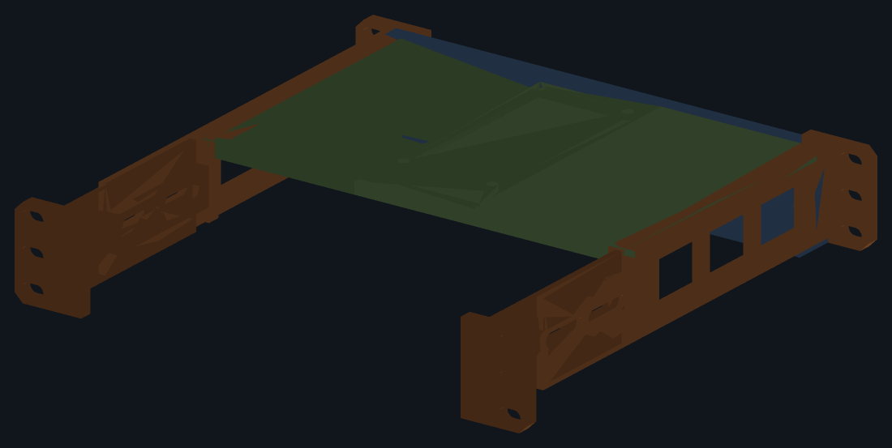
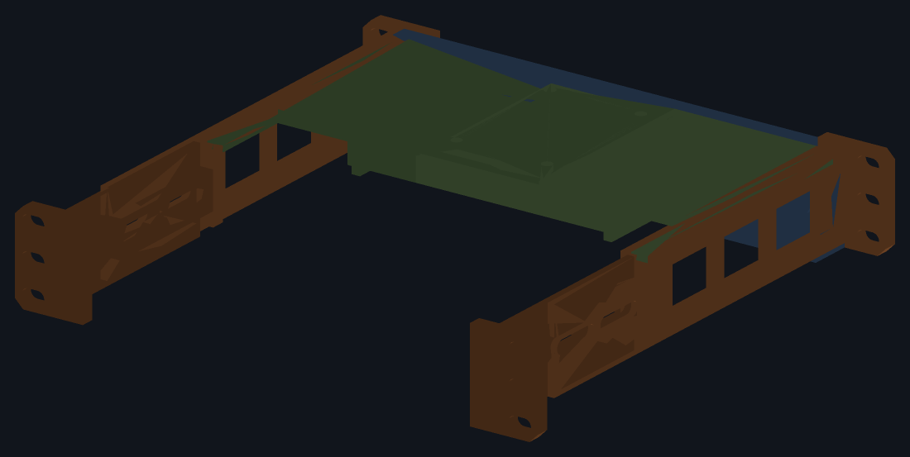

# Lab Rax 1U device brackets

*(repo `UCG_Fiber-LabRax`, named after the first device it carried)*

**1U brackets for a [Lab Rax 10" rack](https://makerworld.com/en/models/1464819-lab-rax-10-server-rack-bolted-version-5u),
bolted to the front *and* rear posts.**

## What you can mount

Four devices are modelled and checked today:

| device | model code | size (mm) | faces the front | print |
|---|---|---|---|---|
| **UniFi Cloud Gateway Fiber** | `UCG-Fiber` | 212.8 × 127.6 × 30, 734 g | its 0.96" display, through an oval window | `UCG_Fiber_LabRax-A1mini.3mf` |
| **UniFi Flex Mini 2.5G** | `USW-Flex-2.5G-5` | 117.1 × 90 × 21.2, 206 g | its 5 × 2.5 GbE ports, through an open frame | `USW_Flex_LabRax-A1mini.3mf` |
| **TP-Link Easy Smart switch** | `TL-SG108E` | 158 × 101 × 25 | its 8 × GbE ports, through an open frame | `TL_SG108E_LabRax-A1mini.3mf` |
| **Intel NUC, Skull Canyon** | `NUC6i7KYK` | 211 × 116 × 28, 45 W | its front USB and audio, through an open frame | `NUC6i7KYK_LabRax-A1mini.3mf` |

**There is one 3MF per device and each carries the chassis too**, six plates:
1–3 the shared chassis, 4–6 that device's own tray pair and faceplate. Open
one, print all six, done. Every plate is labelled in Bambu Studio with the kit
it belongs to. If you build both, the three chassis plates are identical in
the two files — print them once.


### Will mine fit?

Anything inside this envelope can be carried without touching the chassis —
only a new profile in `src/devices.py` and three prints:

| | limit | set by |
|---|---|---|
| width | **up to 212.8 mm** | the bay between the rails, 214.0 less clearance |
| depth | **up to 127.6 mm** | the ledge, which runs y 8 – 137 |
| height | **up to 33.65 mm** | 1U, less the tray and a flange to cap the device |
| weight | the gateway's 734 g is the tested case | a 214 × 132 × 6 tray deflects ~0.2 mm under it |
| cooling | passive, or drawing air from underneath | a tray can be slotted, but the front is closed apart from its opening |

A device narrower than **210.8 mm** gets walls on its tray to hold it straight,
since the sides' rails no longer touch it; those walls need the device to be
**204.8 mm or less**, so widths between 204.8 and 210.8 are the one gap in the
range. A device shorter than the U can have a plinth under it to centre it in
the opening, as the switch does. The faceplate is either a **window** onto a
display or a **frame** onto ports — say which in the profile and the rest
follows.

**A device that breathes through its underside gets a slotted tray.** Set
`vent=True` in its profile and fore-and-aft slots open the full-thickness part
of each half — 27% of the width, floor to case, measured rather than assumed.
The centre lap stays solid: a hole there would have to pass through both
halves where they overlap, and that lap is the joint holding the tray
together.

What it cannot do: anything over 1U, anything deeper than the ledge, or
anything needing full access to both long faces at once — the faceplate closes
the front apart from its opening, so the busier face has to go to the back.

**Four of the seven parts are a chassis that takes no notice of what is in
it.** The sides and the rear legs are sized by the rack alone; only the tray
pair and the faceplate are drawn around a device. A second device therefore
costs three prints rather than seven, and a chassis already printed carries
over untouched.

It is not a front cantilever. The gateway is heavy enough that hanging it off
the front posts alone would work the plastic, so each side splices to a rear
leg that reaches the back posts — four mounting points, twelve screws.

Modelled in **FreeCAD** but generated by script rather than drawn.
`src/params.py` holds every dimension, `src/devices.py` a profile per device,
and `src/model.py` builds the bodies from them. Each part is a PartDesign
**Body** of **sketches** driving a **pad** or **pocket**, so the document opens
as something you can edit feature by feature.

```sh
make            # build, verify, render, plate
make verify     # re-check the solids against the rack, each device and the bed
make assembly   # put real M6 x 12 screws, nuts and washers in and check them
make plate      # one 3MF per device in export/3mf/, for Bambu Studio
make plates     # slice every plate for real and measure the toolpaths
```

## Parts

Seven prints for one device, none over a 180 mm bed.

| part | size (mm) | qty | kit |
|---|---|---|---|
| `side_l` / `side_r` | 33 × 212.5 × 44.5 | 1 each | chassis |
| `leg_l` / `leg_r` | 33 × 97.5 × 44.5 | 1 each | chassis |
| `tray_ucg_l` / `tray_ucg_r` | 137 × 131.6 × 9 | 1 each | UCG-Fiber |
| `faceplate_ucg` | 214 × 20 × 44.5 | 1 | UCG-Fiber |
| `tray_usw_l` / `tray_usw_r` | 137 × 94 × 19.6 | 1 each | Flex Mini |
| `faceplate_usw` | 214 × 20 × 44.5 | 1 | Flex Mini |
| `tray_sg108e_l` / `tray_sg108e_r` | 137 × 105 × 17.8 | 1 each | TL-SG108E |
| `faceplate_sg108e` | 214 × 20 × 44.5 | 1 | TL-SG108E |
| `tray_nuc_l` / `tray_nuc_r` | 137 × 120 × 11.2 | 1 each | NUC6i7KYK |
| `faceplate_nuc` | 214 × 20 × 44.5 | 1 | NUC6i7KYK |

A **side** carries the front ear, the side rail, the ledge the tray lands on,
and a rear stop. A **rear leg** laps 60 mm onto the inner face of that rail,
bolts through two M6, and carries the rear ear out to the back posts.

The **tray** comes in halves — at 214 mm it will not fit the bed in any
orientation — lapping 60 mm across the centreline, the left half passing
underneath. Four ⌀5 pegs key them. **They take no screw**: the one that used
to be there snapped off both halves the first time it was tightened.

The **faceplate** is the front, in one piece. What is cut in it depends on the
device: a window to see a display through, or a frame opening onto ports.

At 214 × 44.5 mm it will not lie flat on a 180 mm bed — 187 mm on the diagonal
— so it prints **stood on edge and upside down**, 165.5 mm cornerwise. Upside
down matters: the right way up, the flange that reaches over the device is a
12 mm shelf hanging over nothing. Inverted, that flange lies on the bed and
needs no support.



## Why the chassis is shared

Because its width comes from the **rack**, not from the gateway. The posts
leave 222.25 mm between them; 0.925 mm of clearance a side and a 3.2 mm rail
give a bay **214.0 mm** wide. The UCG-Fiber needing exactly that is a happy
accident of a well-chosen device — so a device half the width needs no change
to the sides or legs at all.

The sides' ledge and rear stop are likewise the chassis's own numbers now. A
device shorter than the stop simply leaves it unused behind it and is caught
by its own tray's lip instead.

Adding a device means adding a profile to `src/devices.py` — case size, mass,
how far to lift it, and what the faceplate does — and nothing else.

## Compatibility with the rack

Interface numbers were measured off the Lab Rax models themselves rather than
taken from prose, because the published figures are rounded. The rack's own
3MFs sit one level up, in `../`. See
[docs/measurements.md](docs/measurements.md).

| | value | source |
|---|---|---|
| Faceplate | 254.0 × 44.45 mm (1U) | Lab Rax reference faceplate |
| Screw columns | 236.525 mm apart | rack posts |
| Hole heights in the U | 6.35 / 22.225 / 38.1 mm | EIA-310, confirmed on the posts |
| Screws | M6 | Lab Rax uses M6 throughout |
| Clear width between posts | 222.25 mm | derived from the post holes |
| Clear depth between posts | 170.0 mm | three frame members in the rack's 3MF |
| Front posts to rear posts | 235.0 mm outer | 170.0 + two 32.5 mm posts |

**The rack posts already hold the nuts.** Measured from a post's outer face: a
⌀7.60 clearance hole 2 mm deep, then a hexagon 10.09 mm across the flats and
5 mm deep — an M6 nut. So every rack screw is driven from **outside the rack
inwards**, and the bracket's ears carry nothing but clearance slots, 11.0 ×
6.6 mm, giving ±2.3 mm of adjustment.

**Depth is set by fitting, not by the number.** The side panel's 175.9 mm is
not the gap between the posts: the panel is 3 mm thick and seats about 2.95 mm
into a groove at each end, and 170.0 + 2 × 2.95 is 175.9 exactly. Reading
175.9 as the gap once made this bracket 16 mm too long. The post's section is
30 × 35 and the mesh does not say which way it faces, so the outer depth is
either 230 or 240; the nominal sits between them at 235 and **both halves of
the splice are slotted — ±9.8 each, ±19.6 together, covering 215.4 – 254.6 mm**.
Slide the legs until the rear ears meet the posts, then tighten.

## Fasteners

**One screw for the whole bracket: M6 × 12.**

| qty | item |
|---|---|
| 20 | M6 × 12 button head |
| 8 | M6 nut — DIN 934, 10 mm across the flats, 5 mm thick |
| 16 | M6 washer — DIN 125 form A, ⌀12.5 |

| qty | where | nut | washer |
|---|---|---|---|
| 12 | bracket to rack: 3 per ear, 4 ears | none — in the post | yes |
| 4 | faceplate, through the front ears | 4 × M6 | no |
| 4 | side to rear leg, through the splice slots | 4 × M6 | yes |

**The length is not a free choice.** The post's hole is **blind at 6 mm**, so a
screw that goes more than 6 mm past the ear hits the end and never clamps, and
one that goes much less than 5 mm barely catches the nut. That fixes the ear at
**6.5 mm**: a 12 mm screw then enters 5.5 mm, with 3.5 mm of thread in the nut
and half a millimetre to spare.

**The sixteen washers are not optional.** Those screws go through slots, and an
M6 head is wider than a slot is: without a washer it lands on two crescents of
about 25 mm² and will bury itself in PETG. A washer takes that to 46–60 mm².

The tray takes no fastener at all.

**A nut is fed in from the rear, and the flange can be in its way.** The two
upper nut pockets sit at z = 30.16, fixed by the sides — which are shared —
while the faceplate's flange sits on top of the device, which is not. A short
device pulls the flange down into the path the nut has to travel: on the Flex
Mini it sat **1.58 mm** into it and the upper nuts could not be fitted at all,
and the TL-SG108E cleared by 0.32 mm, which is no clearance on a printed part.
Where that gap falls under `NUT_FEED_CLEAR`, the flange is cut back at those
two positions. It costs nothing — at x = ±100 the flange is outboard of every
device carried here. `verify` sweeps a nut the whole 17 mm of its travel
rather than only checking that it seats, because seating is not fitting.

## How each device is held

| | UCG-Fiber | Flex Mini 2.5G |
|---|---|---|
| sits at | z 6.0 – 36.0 | z 11.625 – 32.825 |
| sideways | the sides' own rails, 0.6 mm a side | walls on its tray at x ±59.15 |
| up | the faceplate's flange, 0.8 mm over the case | the same, at z 33.625 |
| back | its tray's rear lip at y 136.6 | its tray's rear lip at y 99.0 |
| forward | the faceplate across its whole face | the frame's border |

**The gateway** fills the bay, so the rails hold it straight and the ears
overlap its ends by 12.4 mm. Its display faces front through a **22.5 × 11.0
window** with a 6 mm round-over, placed by a rule about the printed part — the
oval's top edge sits exactly 7.0 mm below the underside of the top bar — which
`verify` measures on the built solid. Two calliper readings taken off the case
put that window wrong before the rule replaced them.

**The switch** is another matter. It is 96.9 mm narrower than the bay and
8.8 mm shorter, and its ports are what you look at, so its tray carries a
**5.625 mm plinth** that lifts the case until it is centred in the U — 22.225,
which is the U's centre to three decimals — and **4 mm walls at x ±59.15** that
hold it straight. Its faceplate is a **frame**: a 109.1 × 17.5 mm opening onto
the ports, leaving a 4 mm border each side and 1.85 mm top and bottom.

That border is what retains it, and retention is absolute rather than
frictional: a 117.1 × 21.2 case cannot pass a 109.1 × 17.5 hole. The **plug**
sets the height — an RJ45 with its latch needs about 16 mm on a case only
21.2 mm tall — so `verify` sweeps a 12 × 16 mm plug envelope through the
opening *and* the 8 mm of plate behind it to prove one fits.



## Orientation and cooling

The gateway's ports and DC input are on one long face and its 0.96" display on
the other. The faceplate's window commits you to **display at the front,
cables at the back**. The switch is the opposite: **ports at the front**,
through the frame.

Both devices are fanless. Each side rail carries three windows, the rear is
left open, and the tray is clear underneath. Print in **PETG** — a gateway
running IDS/IPS gets warm enough that PLA is a poor choice around it.

One thing to know about the rear: the outer 7.4 mm of each end of the
gateway's back panel is covered full height by the side's rear stop and the
leg behind it. Keep plugs out of that last 7.4 mm.

## What is checked

Two tools, each run once per device, and they check different things.

`make verify` measures the **built solids**, not the parameters, so a feature
that silently does nothing is caught rather than assumed away. **174 checks for
the gateway, 169 for each switch, 173 for the NUC.** That each body is one valid solid built from
sketches driving pads and pockets; that it fits the bed, turned on the diagonal
if it has to; that no two parts foul each other; that an M6 passes all twelve
rack slots and does not bottom out in the post's blind hole; that both halves
of the splice slot far enough; that the tray is solid under the device all the
way across, that the halves lap rather than butt, that all four pegs meet a
socket; that the device drops in, is stopped on every face, and cannot be
pushed out of the front.

`make assembly` is less forgiving, because arithmetic can agree with itself
while the hole is somewhere else entirely. It places a real M6 × 12, a real nut
and a real washer at each of the twenty positions and asks whether they fit
what was actually built — **107 checks per device**: that each shank is clear
the whole way, that each head has something to bear on and how much, that each
nut sits in its pocket, and that no fastener touches the device.

`make plates` slices every plate for real and reads the toolpath extents back
out of the G-code, because a part that fits the bed and a print that fits the
bed are not the same claim.

### What they have caught

- The **top bar overrunning** the 222.25 mm post opening; a **notch cut on the
  wrong side** of its sketch plane; a **nut slot on the wrong side** of its
  bolt; a malformed **slot wire** whose mismatched endpoints made the solver
  distort the two sides differently.
- The **washers**. Sixteen heads had 25 mm² of plastic under them and nothing
  had noticed, because no dimension was wrong — the slot and the head were each
  exactly as intended.
- The **missing rear lip**. One check walks the device's rear face and asks, at
  each of ~107 positions, whether *anything* is behind it. Run against the
  geometry before the lip existed, **198 of 213 positions came back empty**,
  while every other check passed. A whole face being open is not a dimension
  that can be wrong, which is why coverage has to be measured directly.
- A **window placed against itself**. The display check built its panel at the
  window's own height, so the window was compared to itself and would have
  passed anywhere. That is how one got printed 5 mm low.

### What they missed

The tray's centre bolt tab passed every geometric check — the screw fitted,
the nut seated, nothing fouled — and snapped off both halves on first
tightening, because no check asked what the **stress** would be. A CalculiX run
afterwards put the tab's yield load at 26 N against roughly 1700 N of preload.
Geometry that fits is not geometry that holds.

## Caveats

- **Set the depth by the splice, not by `RACK_D`.** The rack's own parts give
  230 or 240 depending on which way the post faces; 235 is the midpoint and
  the slots cover ±19.6 mm. Fit it, then tighten.
- **0.925 mm per side between the rails and the posts is the tightest
  dimension.** Print one side first and offer it up before committing to the
  rest.
- Device dimensions are Ubiquiti's published figures, not calliper
  measurements. `CLR_W` is 1.2 mm; widen it if yours is tight.
- **Before printing the switch faceplate**, measure the port strip on your
  unit — first RJ45's left edge to the USB-C's right edge, and its height. The
  opening exposes all but a 4 mm border and should clear everything, but this
  project has already had two calliper readings drive a reprint.
- `cad/*.FCStd` and `export/step/*` embed a build timestamp, so `make` leaves
  them looking modified even when nothing changed. The 3MF and the STLs are
  reproducible. Discard that churn with `git checkout -- cad export/step`.

## Layout

```
src/
  params.py       every rack and design dimension, tagged [rack] / [design]
  devices.py      one profile per device: case, mass, plinth, front opening
  sk.py           sketch plumbing: planes, polygons, slots, hex slots, pads,
                  pockets, fillets, and finding edges by where they are
  model.py        four chassis bodies plus three per device
build.py          writes cad/, export/stl/, export/step/
tools/
  verify.py       174 / 169 checks against the rack, the device and the bed
  assembly.py     107 checks with real M6 solids at all twenty positions
  measure_rack.py re-derives the [rack] numbers from the Lab Rax mesh files
  preview.py      renders images/ (FreeCAD is headless here)
  plate.py        arranges the STLs onto A1 mini plates as a Bambu 3MF
  checkplates.py  slices every plate for real and measures the toolpaths
docs/
  bom.md          what to print, what to keep, what to buy
  measurements.md where every number came from
  print-settings.md
```

## Printing

Nine plates in `export/3mf/UCG_Fiber_LabRax-A1mini.3mf`, grouped as kits:

| plates | kit | filament | time |
|---|---|---|---|
| 1–3 | chassis (in every file) | 109.2 g | 5 h 28 |
| 4–6 | UCG-Fiber | 149.7 g | 5 h 20 |
| 4–6 | Flex Mini 2.5G | 135.7 g | 5 h 00 |
| 4–6 | TL-SG108E | 142.9 g | 5 h 16 |
| 4–6 | NUC6i7KYK | 134.1 g | 5 h 14 |

Print the chassis once and then the kit for whatever you are racking: about
259 g for the gateway, 245 g for the switch. Full details, and what survives
from an earlier print, in [docs/bom.md](docs/bom.md).
